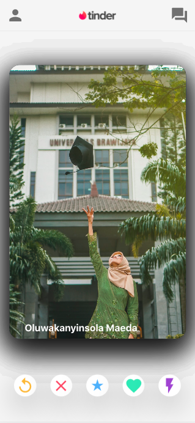

# Basic MERN Stack App

Hello, welcome to my first MERN project. This is a full-stack project with a live demo available [here](https://app-clone-frontend.firebaseapp.com/).

<p align="center">
    
    
</p>

## Table of Contents

1. [General Info](#general-info)
2. [Technologies](#technologies)
3. [Installation](#installation)
4. [Collaboration](#collaboration)

## General Info

---

I've built a React frontend, set up a Node.js server, used Express middleware, and added a MongoDB database seeded with photos from Unsplash. The React front end uses [Material UI](https://material-ui.com/), [axios](https://axios-http.com/) for API calls, and [react-tinder-card](https://www.npmjs.com/package/react-tinder-card).

## Technologies

---

### Front-End

* React

### Back-End

* Express
* Node.js
* MondoDB

## Installation

---

### Steps to run this app in development mode:

1. Fork the repo and clone it.
2. Make sure you have ```yarn```, ```Node.js```, ```nodemon``` & ```MongoDB``` installed in your system.
3. Open two terminal windows and change directories (```cd```)(one for running Server and other for the UI).

*In the app-clone-backend directory:* 

4. **Only once**: Run ```npm install```.
5. Run ```nodemon server.js``` to start the server. By default it will run on port 8001 (Feel free to test this by visiting http://localhost:8001 and you will see 'Hello World' in the browser).

*In the app-clone-frontend directory:* 

6. **Only once**: Run yarn install.
7. For UI run ```yarn start``` and it will open on a new tab on port 3000.
8. Go to http://localhost:3000 to see the application running.

## Collaboration

---

Please let me know if you spot areas of improvement or opportunities for refactoring.  I love to learn and appreciate constructive feedback!

> Contact me at:
> https://ommiles.com/